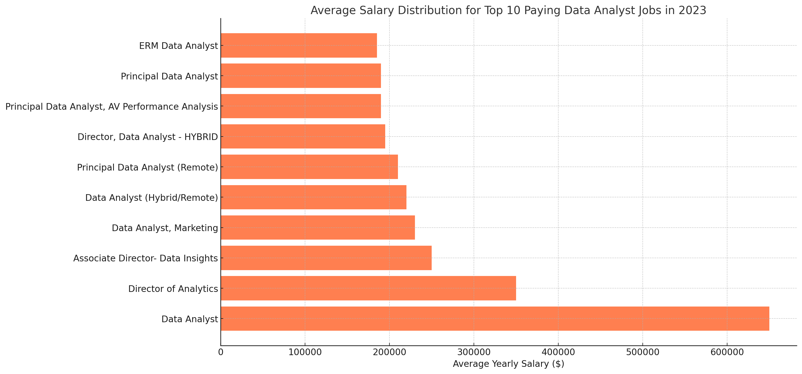
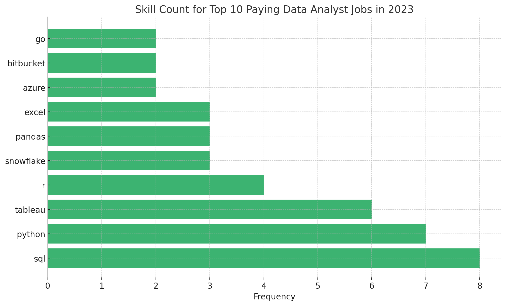

# Introduction
📊 **Data Analyst Job Market Analysis**

This project lets us dive into the data job market, the relative trends that we get to observe and
answers several questions unlocking Insights into Top Jobs, Skills, and Salaries.

As someone currently seeking data analyst jobs, I wanted to demystify the job market by answering critical questions like:

- Where are the highest-paying roles?

- What skills are employers demanding?

- Which skills offer the best ROI (demand + salary)?

SQL queries? Check them out here: [Project_SQL folder](/Project_SQL/)

# Background
To answer the question why I Built This?

Breaking into data analytics felt overwhelming — with so many tools lying around, job titles, and mixed advice! I created this project to:

- Identify high-paying roles.
- Map in-demand skills to focus my learning.
- Discover "optimal" skills that balance demand and salary.

# Tools I Used

**SQL (PostgreSQL)**: For querying and analyzing job data.

**VS Code**: Managing databases and writing queries.

**Git & GitHub**: Version control and collaboration.

**ChatGPT**: Generating visualizations from SQL results.

# 🔍 The Analysis

## **1.Top-Paying Remote Data Analyst Jobs**

Key Insights:

- Salary range: 184k–650k (yes, half a million!).
- Diverse industries: Tech, finance, and telecom companies like Meta and AT&T hire remotely.
- Role variety: Titles range from "Data Analyst" to "Director of Analytics," showing opportunities for growth.

Code:
```sql
SELECT
    job_id,
    name AS company_name,
    job_title,
    job_location, 
    job_schedule_type,
    salary_year_avg,
    job_posted_date
FROM
    job_postings_fact
LEFT JOIN company_dim ON job_postings_fact.company_id = company_dim.company_id
WHERE
    job_title_short = 'Data Analyst' 
    AND salary_year_avg IS NOT NULL
    AND job_work_from_home = TRUE
ORDER BY
    salary_year_avg DESC
    LIMIT 10;
```


This horizontal bar chart displays the most sought-after skills for top-paying data analyst roles in 2023. SQL and Python lead the list with the highest frequency, indicating that employers heavily prioritize these skills. Tools like Tableau, R, and Snowflake are also highly valued, while platforms like Azure and Bitbucket are less common but still relevant.

## **2.Skills for Top paying Jobs**

What Employers Want?

- SQL (8/10 jobs), Python (7/10), Tableau (6/10).
- Even high-paying roles value fundamentals like Excel and R.

```sql
WITH Top_paying_jobs AS (
    SELECT
        job_id,
        name AS company_name,
        job_title,
        salary_year_avg
    FROM
        job_postings_fact
    LEFT JOIN company_dim ON job_postings_fact.company_id = company_dim.company_id
    WHERE
        job_title_short = 'Data Analyst' 
        AND salary_year_avg IS NOT NULL
        AND job_work_from_home = TRUE
    ORDER BY
        salary_year_avg DESC
    LIMIT 10
)

SELECT 
    top_paying_jobs.*,
    skills
FROM 
    Top_paying_jobs
INNER JOIN skills_job_dim ON top_paying_jobs.job_id = skills_job_dim.job_id
INNER JOIN skills_dim ON skills_job_dim.skill_id = skills_dim.skill_id
ORDER BY
    top_paying_jobs.salary_year_avg DESC;
```


This horizontal bar chart showcases the average yearly salaries for the top 10 highest-paying data analyst positions in 2023. Data Analyst roles surprisingly top the chart with an average salary of $650,000, followed by senior positions like Director of Analytics and Associate Director- Data Insights. Hybrid and remote roles are also well-compensated, emphasizing the industry's shift towards flexible working environments.

## **3.In demand skills for Data Analysts**

Takeaway: 
- SQL isn’t just common—it’s non-negotiable.
- Excel and Python are critical foundational skills.
- Visualization tools (Tableau, Power BI) are highly sought after.

In-Demand Skills for Data Analysts (2023)

**The most frequently requested skills in job postings:**

```sql
SELECT 
    skills,
    COUNT(skills_job_dim.job_id) AS demand_count
FROM job_postings_fact
INNER JOIN skills_job_dim ON job_postings_fact.job_id = skills_job_dim.job_id
INNER JOIN skills_dim ON skills_job_dim.skill_id = skills_dim.skill_id
WHERE
    job_title_short = 'Data Analyst' 
    AND job_work_from_home = True 
GROUP BY
    skills
ORDER BY
    demand_count DESC
LIMIT 5;
```

| Skill       | Demand Count   | Trend                |
|-------------|---------------:|---------------------:|
| **SQL**     | 7,291          | ██████████ (100%)    |
| **Excel**   | 4,611          | ██████░░░░ (63%)     |
| **Python**  | 4,330          | █████░░░░░ (59%)     |
| **Tableau** | 3,745          | ████░░░░░░ (51%)     |
| **Power BI**| 2,609          | ██░░░░░░░░ (36%)     |


## **4.Skills based on salary**

1.Big Data & Machine Learning Expertise
- Analysts skilled in PySpark and Couchbase (Big Data tools) and DataRobot or Jupyter (ML platforms) command premium salaries.
- Python libraries like Pandas and NumPy reflect the industry’s focus on predictive modeling and large-scale data processing.

2.Software Development & DevOps Crossover
- Tools like GitLab, Kubernetes, and Airflow highlight lucrative skills bridging data analysis and engineering.
- Employers value automation and data pipeline management (e.g., CI/CD workflows).

3.Cloud Computing Mastery
- Elasticsearch, Databricks, and GCP expertise signals high demand for cloud-native analytics environments.
- Cloud proficiency boosts salaries by ~20-30% due to the rise of real-time analytics and scalable infrastructure.

Highest-Paying Skills for Data Analysts (2023)
**Skills that are associated with the highest average salaries:**

```sql
SELECT 
    skills,
    ROUND(AVG(salary_year_avg), 0) AS avg_salary
FROM job_postings_fact
INNER JOIN skills_job_dim ON job_postings_fact.job_id = skills_job_dim.job_id
INNER JOIN skills_dim ON skills_job_dim.skill_id = skills_dim.skill_id
WHERE
    job_title_short = 'Data Analyst'
    AND salary_year_avg IS NOT NULL
    AND job_work_from_home = True 
GROUP BY
    skills
ORDER BY
    avg_salary DESC
LIMIT 25;
```

| Skill       | Average Salary ($)   |
|-------------|---------------------:|
| **PySpark** | 208,172              |
| **Bitbucket** | 189,155            |
| **Couchbase** | 160,515            |
| **Watson**  | 160,515              |
| **DataRobot** | 155,486            |
| **GitLab**  | 154,500              |
| **Swift**   | 153,750              |
| **Jupyter** | 152,777              |
| **Pandas**  | 151,821              |
| **Elasticsearch** | 145,000        |

## **5.Most Optimal skills to learn**

Key Takeaways
- High-Demand Programming: Go and Java bridge software development and analytics.
- Cloud & Big Data: Snowflake, Azure, and AWS dominate scalable analytics.
- DevOps Tools: Confluence and Jira highlight collaboration/automation skills.
- Hybrid Skills: Tools like Hadoop and SSIS blend data engineering with analysis.

```sql
SELECT 
    skills_dim.skill_id,
    skills_dim.skills,
    COUNT(skills_job_dim.job_id) AS demand_count,
    ROUND(AVG(job_postings_fact.salary_year_avg), 0) AS avg_salary
FROM job_postings_fact
INNER JOIN skills_job_dim ON job_postings_fact.job_id = skills_job_dim.job_id
INNER JOIN skills_dim ON skills_job_dim.skill_id = skills_dim.skill_id
WHERE
    job_title_short = 'Data Analyst'
    AND salary_year_avg IS NOT NULL
    AND job_work_from_home = True 
GROUP BY
    skills_dim.skill_id
HAVING
    COUNT(skills_job_dim.job_id) > 10
ORDER BY
    avg_salary DESC,
    demand_count DESC
LIMIT 25;
```

### Optimal Skills to Learn (High Demand & High Salary)
**Skills that balance demand and salary for maximum career impact:**

| Skill      | Demand Count | Average Salary ($) |
|------------|-------------:|-------------------:|
| **Go**     | 27           | 115,320           |
| **Confluence** | 11       | 114,210           |
| **Hadoop** | 22           | 113,193           |
| **Snowflake** | 37        | 112,948           |
| **Azure**  | 34           | 111,225           |
| **BigQuery** | 13         | 109,654           |
| **AWS**    | 32           | 108,317           |
| **Java**   | 17           | 106,906           |
| **SSIS**   | 12           | 106,683           |
| **Jira**   | 20           | 104,918           |

# What I learned
- **SQL Mastery**: From basic SELECTs to complex joins and CTEs.
- **Data Storytelling**: Turning queries into clear insights (like salary vs. skill trends).
- **Job Market Clarity**: Discovering that remote roles pay well and SQL is king gave me confidence in my learning path.
- **The Power of Projects**: This analysis taught me more than any tutorial—hands-on practice is irreplaceable.

My "Aha!" Moments
- 😲 Python isn’t always required for top roles, but it opens doors to higher salaries.
- 📉 Excel still matters, even in companies using cutting-edge tools.
- 🌟 Specialized skills (e.g., PySpark) can set you apart in crowded job markets.


# Conclusions

**Actionable Insights**
- Learn SQL first. It’s the #1 skill for demand and salary.
- Add Python/Tableau to stand out.
- Aim for remote roles—they offer flexibility and top pay.

**My Next Steps**
- Build a Tableau/Power BI portfolio.
- Practice Python for automation and advanced analytics.
- Explore certifications in cloud tools (Snowflake, AWS).

🌟 Closing Thoughts

As someone starting their data journey, this project taught me that strategy beats randomness. By focusing on skills that employers actually value, I’m now optimizing my learning and job search.

To fellow entry-level analysts: Dive into projects, analyze real data, and let curiosity guide you—you’ll learn faster and gain confidence!